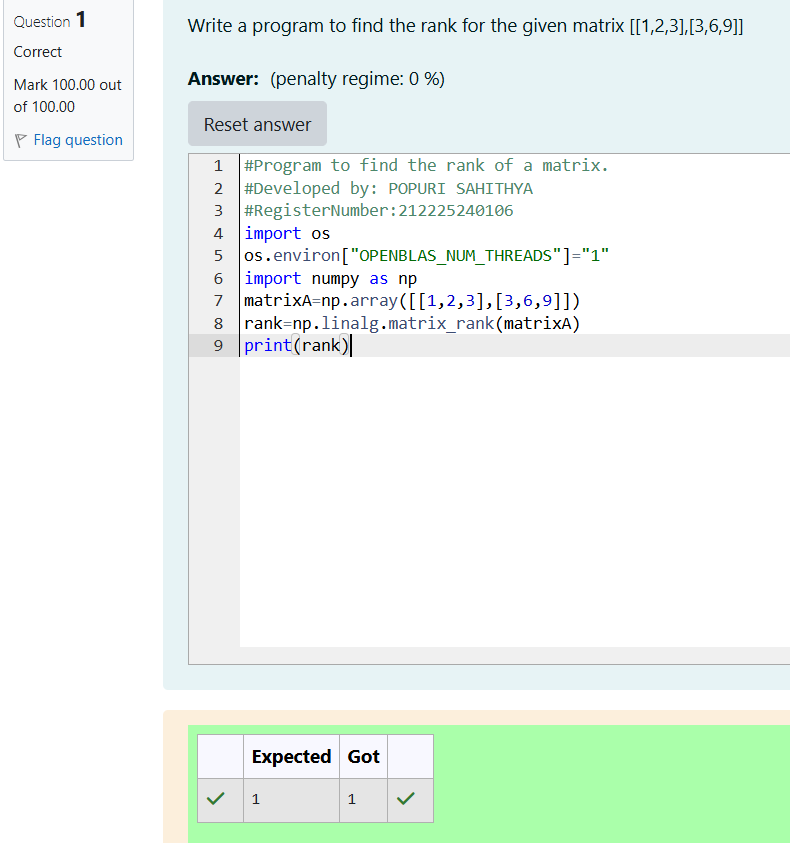

# RANK-OF-A-MATRIX
## Aim:
To write a python program to find the rank of a matrix
## Equipment’s required:
1. 	Hardware – PCs
2. 	Anaconda – Python 3.7 Installation / Moodle-Code Runner
## Algorithm:
### Step 1: Begin the program.
### Step 2: Define or take input of the matrix whose rank is to be calculated.
### Step 3: Use a mathematical method (like NumPy matrix_rank() or row reduction/Gaussian elimination) to determine the number of linearly independent rows or columns.
### Step 4: Print the rank of the matrix and end the program.

## Program:
```
#Program to find the rank of a matrix.
#Developed by: POPURI SAHITHYA
#RegisterNumber:212225240106
import os
os.environ["OPENBLAS_NUM_THREADS"]="1"
import numpy as np
matrixA=np.array([[1,2,3],[3,6,9]])
rank=np.linalg.matrix_rank(matrixA)
print(rank)
```
## Output:

## Result:
Thus the rank for the given matrix is successfully solved by  using a python program.

